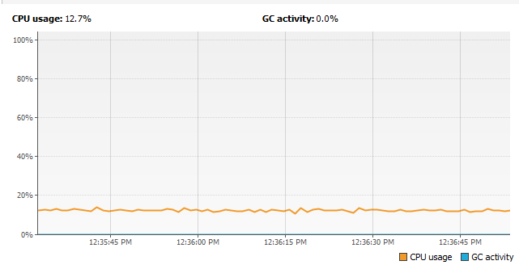

# Arquitecturas de Software
# Laboratorio 2 Paralelismo y Concurrencia

## Integrantes
- David Alejandro Vasquez Carreño
- Michael Jefferson Ballesteros Coca

____________

#### Part I - Before finishing class

1. Chequeo de consumo de CPU en ejecución. 
    
    
    
    Este consumo es debido a que el consumidor hace una espera activa para verificar
    que la cola tenga elementos de los que sacar productos. Como regla, los threads o procesos 
    que esperen a que un recurso se libere no deben hacer uso 
    de cómputo. 
    
      ```
    while (true) {
                if (queue.size() > 0) {
                    int elem=queue.poll();
                    System.out.println("Consumer consumes "+elem);                                
                }
            }
      ```

2. El consumo de CPU se va a mejorar a través del uso de wait() y notify() sobre la cola, de
modo de que el consumidor no consuma recursos mientras la cola está vacía.

    ```
    synchronized(queue){
        if (queue.size() > 0) {
            int elem=queue.poll();
            System.out.println("Consumer consumes "+elem);                                
        }else{
            try {
                queue.wait();
            } catch (Exception e) {
                //TODO: handle exception
            }
        }
    }   
    ```

        
El bloque de sincronización pide el lock sobre el objeto y hace que el hilo consumidor espere si no
hay elementos sobre la cola.

Del lado del productor, cada vez que insertemos nuevos elementos el la cola, notificamos
a los hilos que estén esperando por este recurso.
      
   ```
    synchronized(queue){
        queue.notify();
    }
   ```
Vemos que el consumo de CPU de ha reducido.

   

3. Consumidor lento y productor rápido

La implementación es muy parecida a la del punto 2, pero el que va a esperar es el productor. 
El productor espera a que haya espacio.  

***PRODUCTOR***

  ```
  if(stockLimit>queue.size()){
      dataSeed = dataSeed + rand.nextInt(100);
      System.out.println("Producer added " + dataSeed);
      queue.add(dataSeed);
  }else{
      synchronized(queue){
            try {
                queue.wait();
            } catch (Exception e) {
                //TODO: handle exception
            }
      }
  }

  ```


***CONSUMIDOR***

  ```
  synchronized(queue){
      if (queue.size() > 0) {
          int elem=queue.poll();
          System.out.println("Consumer consumes "+elem); 
          queue.notify();                              
      }
  }
  ```


Vemos que el consumo de CPU se ha mantenido bajo.


____________


#### Part II - JAVA IMMORTALS

RESPUESTAS

1. Para N jugadores, ¿Cuál debería ser la suma de las vidas de los jugadores según el invariante?

De manera general, siendo N los jugadores y ***health*** la vida.

Vida total: ***N*** x ***health***

De manera especifica: N x 100

2. Verificación del invariante

    __PAUSA 1__
    
       
    
    __PAUSA 2__
        
      
    
    __PAUSA 3__
            
      
    
Vemos que el invariante no se cumple :anguished:


____________
## Construido con

* [Maven](https://maven.apache.org/) - Manejo de dependencias


## Contribuciones

* **Alejandro Vasquez** - *Extender* - [alejovasquero](https://github.com/alejovasquero)
* **Michael Ballesteros** - *Extender* - [Wasawsky](https://github.com/Wasawsky)